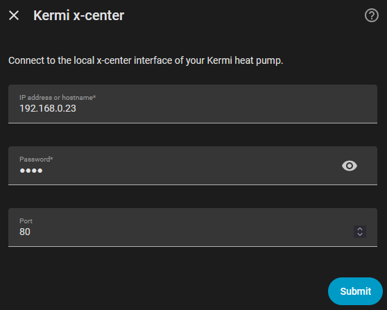
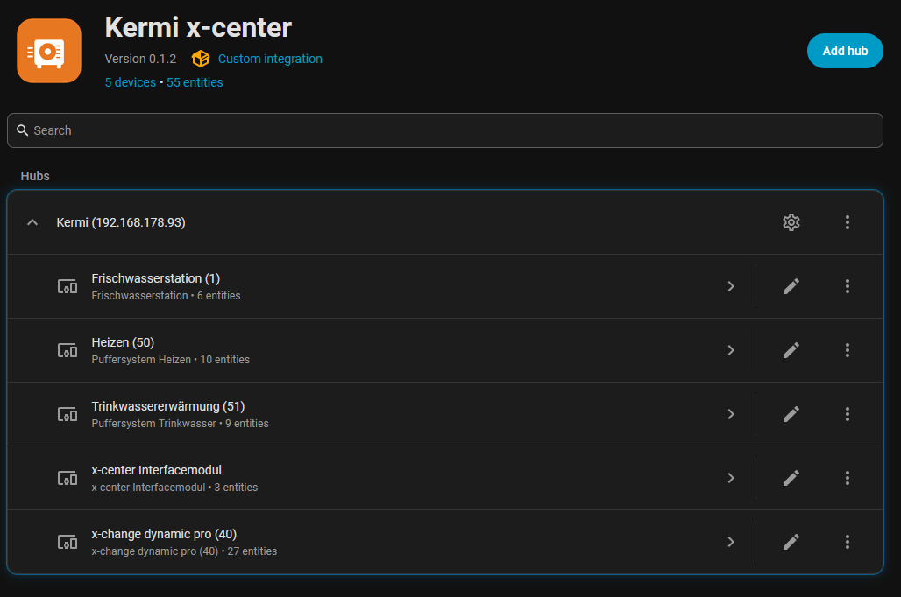

# Kermi x-center for Home Assistant

Unofficial community integration. Not supported by Kermi.

Local Home Assistant integration for Kermi heat pumps with an **x-center interface module**.
It reads live values through the same HTTP API as the web interface (IP + password) — no Modbus and no cloud.

Tested with:

- x-center firmware 1.6.5
- x-change dynamic pro (Rubin, DeviceType 97)
- Buffer system heating / domestic hot water (DeviceType 95)
- Fresh water station Turmalin (DeviceType 104)

## Installation

The integration is not in the HACS default catalog. Add it as a **custom repository** of type Integration.

### Via HACS

1. Open HACS → menu (three dots) → **Custom repositories**.
2. Repository: `https://github.com/alexgoesgit/ha-kermi-xcenter-local`
3. Category: **Integration** → **Add**.
4. Search for **Kermi x-center** and **Download**.
5. Restart Home Assistant.
6. **Settings → Devices & services → Add integration → Kermi x-center**.
7. Enter the IP address (or hostname) and password of the x-center web interface. The port is usually `80`.

### Manual

1. Copy the folder `custom_components/kermi_xcenter_local` to `/config/custom_components/kermi_xcenter_local` on your Home Assistant instance.
2. Restart Home Assistant.
3. **Settings → Devices & services → Add integration → Kermi x-center**.
4. Enter the IP address (or hostname) and password of the x-center web interface. The port is usually `80`.

The password is the same as for the local login in the browser, often the last four digits of the serial number.

## Devices and entities

The integration creates one device per x-center module:

| Device | Examples |
| --- | --- |
| Heat pump | Status, supply/return, electrical/thermal power, COP, flow, defrost |
| Heating | Outdoor temperature, buffer temperature, setpoint, energy mode |
| Domestic hot water | Actual/setpoint TWE temperature, one-time charge |
| Fresh water station | Tap temperature, flow, heat quantity |
| x-center | SmartGrid, utility lock (EVU) |

COP values are `unknown` while the compressor is off (the controller then returns `NaN`). Invalid sensor values such as `-3276.7 °C` are hidden.

Some diagnostic sensors (pressures, EQ temperatures, operating hours) are disabled by default and can be enabled in the entity list.

## Options

Under **Configure**, you can set the polling interval (default 60 s, minimum 10 s).

## Notes

- Home Assistant and the heat pump must be reachable on the same network.
- The integration polls `Menu/GetBundlesByCategory` — this is the endpoint that returns real measured values on Rubin firmware.
- Writing setpoints (operating mode, one-time charge, etc.) is not included in this version yet.

## Credits

The starting point for this custom integration was [kermi-ha-bridge](https://github.com/m-zenker/kermi-ha-bridge) by [Martin Zenker](https://github.com/m-zenker) (MIT license) - an AppDaemon bridge to the local x-center HTTP API.

## Maintainer

[@alexgoesgit](https://github.com/alexgoesgit) — Issues: https://github.com/alexgoesgit/ha-kermi-xcenter-local/issues

## License

Apache License 2.0. Copyright 2026 alexgoesgit. See [LICENSE](LICENSE).

Parts of the API knowledge come from kermi-ha-bridge, Copyright 2026 Martin Zenker, MIT. See [NOTICE](NOTICE).

Kermi and x-center are trademarks of their respective owners. This license does not grant any trademark rights.
